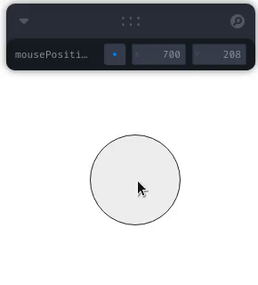

# Controlled Inputs

## set

To change values in leva store from the outside, use the function API
by passing `() => schema` to `useControls`.

```jsx
const [{ value }, set] = useControls(() => ({ value: '' }))

return <input type="text" value={value} onChange={(e) => set({ value: e.target.value })} />
```

Use `set` to update values from outside of Leva GUI.

See an [example in Storybook](https://leva.pmnd.rs/?path=/story/misc-controlled-inputs--external-updates-with-set)

## onChange

`onChange` handler in the schema is called for all changes to the value.
Values with `onChange` will no longer cause React to rerender, so you can use it
to efficiently update frequently changing value.

```jsx
const divRef = React.useRef(null)
const _ = useControls({
  color: {
    value: '#f00',
    onChange: (v) => {
      // imperatively update the world after Leva input changes
      divRef.current.style.color = v
    },
  },
})
```

See an [example in Storybook](https://leva.pmnd.rs/?path=/story/misc-input-options--on-change)

## set and onChange

With `set` and `onChange` we can bind to any imperative API. Whenever external

```jsx
const [, set] = useControls(() => ({
  position: {
    value: { x: 0, y: 0 },
    onChange: (value) => {
      // imperatively update the world after Leva input changes
    },
  },
}))
```

[codesandbox-drag]: (https://codesandbox.io/s/leva-controlled-input-71dkb?file=/src/App.tsx)

[][codesandbox-drag]

See [this CodeSandbox][codesandbox-drag] for an example.

---

@TODO
This page will go in depth on how to replicate use-cases like https://twitter.com/simonghales/status/1357630773323436033
where the values are being changed outside of the GUI

This page should also probably talk about multi-panes and other non dat.GUI situations
